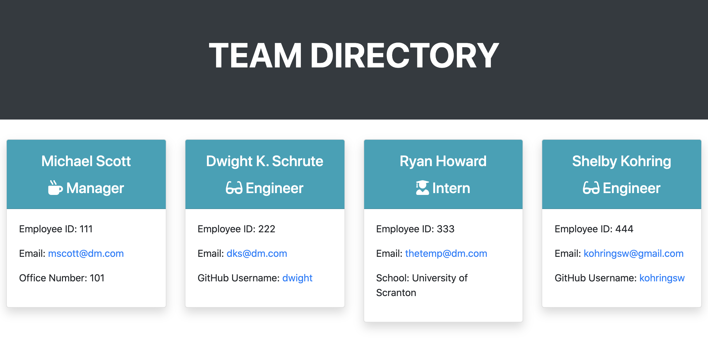

# Team Profile Generator

## Description
This is an application that generates an online portfolio containing profiles for employees based on user input. Using npm inquirer, the user is prompted to answer questions that will create a profile for each employee of their team. These questions include prompts for name, employee ID, email address (using email-validator) and then a choice of Manager, Engineer or Intern. When Manager is selected, then the user is asked for their office number. When Engineer is selected then the usuer is asked for their GitHub username. When Intern is selected then the user is asked for their school. The user is then asked if they would like to continue adding profiles to their team. If they do, the questions start over at the beginning. If they do not, an index.html file is created and the portfolio is generated. 

- Link: [See Team Profile Generator Video Tutorial Here](https://drive.google.com/file/d/160q3O5Piqny91RJ9rwEUaKzZg6b-RulC/view)

- Link: [See the GitHub Repository for this application here](https://github.com/kohringsw/team-profile-generator.git)

## Table of Contents
- [Description](#description)
- [Installation Instructions](#installation)
- [Usage](#usage)
- [Contributors](#contributors)
- [Tests](#tests)
- [License](#license)
- [Questions](#questions)

## Installation Instructions
- Required Installation
  - npm
  - inquirer
  - jest required for testing purposes only

## Usage
This application can be used to generate employee profiles for an online team portfolio.

## Contributors
Shelby Kohring

## Tests
This application was created with testing driven development using npm jest.
- install jest to test

## License 
None

## Questions
If you have questions about this application: 
- Find me on [GitHub: kohringsw](https://github.com/kohringsw) or 
- Email me at [kohringsw@gmail.com](mailto:kohringsw@gmail.com)